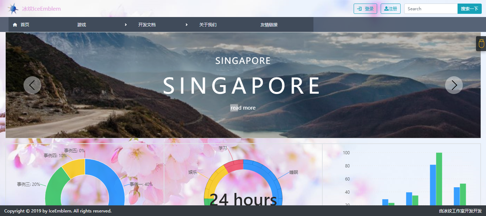
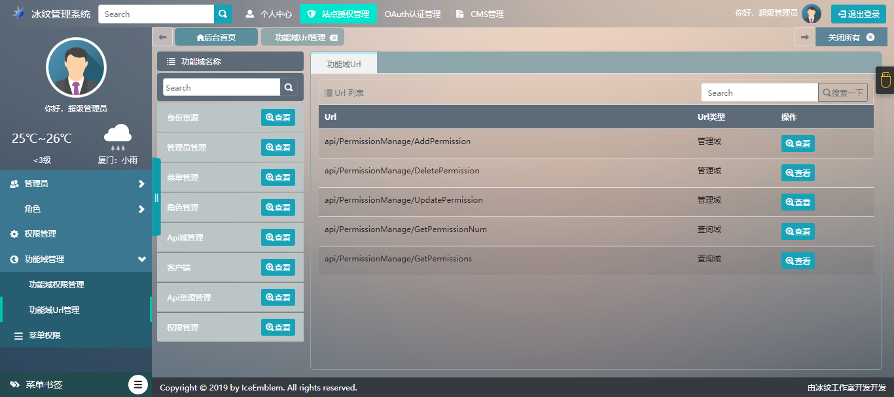
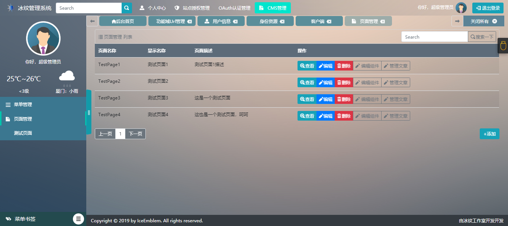

# IEManageSystem
项目演示地址：http://iemanagesystem.azurewebsites.net/Account/
账号：admini
密码：123456
项目截图如下：

项目介绍：
	分支dev1.0_c为个人开发分支，功能最新，bug也多
	以集成个人中心，授权管理，OAuth认证管理，因为时间原因，项目未完全开发完成，打算开发为CMS管理系统，

技术使用：
	冰纹后台管理系统 领域驱动设计实践，前后端分离，认证使用JwtBearer认证，前端可以以多种方式访问后端，项目前端使用浏览器
	
前端：
	Jq，ReactJs，react-router 4.0，Css3，BootStrap4，ES6语法，Webpack打包

后端：
	.net core api，abp框架，ORM框架Ef，IdentityServer4

数据库：
	需要两个数据库（也可以配置为一个）
	程序包管理器控制台运行如下命令：
		默认项目选择：IEManageSystem.Core
			执行：Update-Database
		默认项目选择：IEManageSystem.IdentityServerEF
			执行：Update-Database -c IEPersistedGrantDbContext
			执行Update-Database -c IEConfigurationDbContext