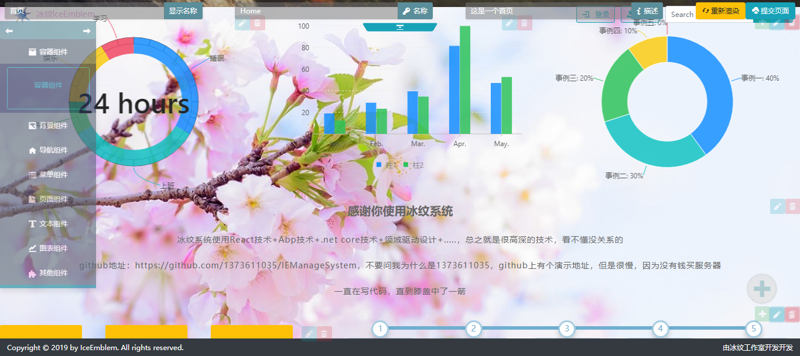
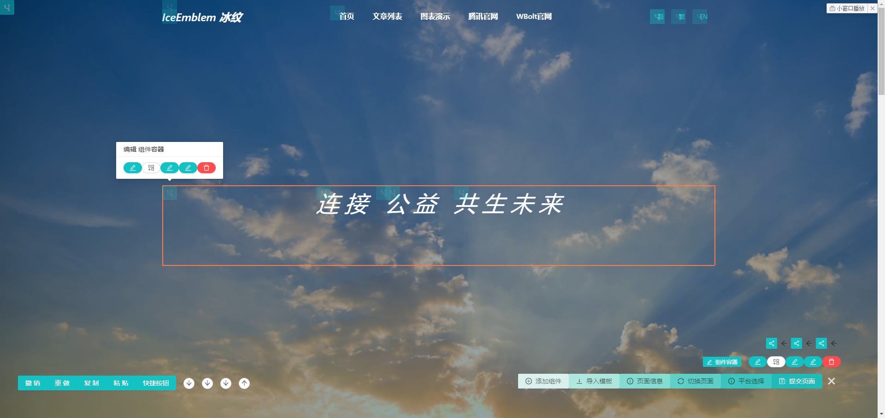

IEManageSystem
=============
#### 项目介绍：
##### 鼠标点击生成页面
> IEManageSystem 是一个CMS管理系统，使用单页模式，通过`鼠标点击生成页面`<br>
> 与国内的一些CMS不同，想开发其CMS，需要学习其标志语法，这会增加开发人员的负担，而对于不会编程的人员，也无法自定义自己的页面<br>
> 而开发IE组件，你只需要了解IE组件的设计和React即可<br>
<br>

##### 源码与功能
> 分支 dev1.0_c 为个人开发分支，最新代码会先提交到该分支<br>
> 以集成个人中心，授权管理，CMS管理<br>
> 前端源码目录：\src\IEManageSystem.Web\ClientApp<br>
<br>

#### 项目演示地址
> 站点是国外的服务器，有点慢<br>
> http://iemanagesystem.azurewebsites.net/Account/<br>
> 账号：admini<br>
> 密码：123456<br>
<br>

#### 项目截图如下：
<br>
<br>
<br>

#### 技术使用：
> 冰纹后台管理系统 领域驱动设计实践，前后端分离，认证使用JwtBearer认证，前端可以以多种方式访问后端，项目前端使用浏览器<br>
前端：<br>
> ReactJs，react-router 4.0， redux， TypeScript，Css3，BootStrap4，ES6语法， jq，Webpack打包<br>
后端：<br>
> asp.net core，abp框架，ORM框架Ef<br>
<br>

#### 数据库：
> 程序包管理器控制台运行如下命令：<br>
>> 默认项目选择：IEManageSystem.EntityFramewordCore<br>
>> 执行：Update-Database<br>
<br>

#### 前端模块开发
简单的模块代码：<br>
```javascript
import React from 'react'
import BaseModule from 'Core/Modules/BaseModule'
import ModuleFactory from 'Core/Modules/ModuleFactory'
import CoreModule from 'Core/Module';

import PageProvider from 'Core/Page/PageProvider'
import Page from 'Core/Page/Page'

// 导出模块
export default class Module extends BaseModule
{
    initialize(){
        // 注册一个 url
        PageProvider.register(new Page("MyModule", "/MyModule", (props) => <p>Hello World</p>));
    }
}

// 指定该模块依赖于 CoreModule
new ModuleFactory().register(Module, [
    CoreModule
]);
```
<br>

#### 前端组件开发
简单的组件代码：<br>
```javascript
import React from 'react'
import BaseComponentObject from '../BaseStaticComponent';
import ComponentDescribe, {componentType} from '../ComponentDescribe'

// 组件对象
class ComponentObject extends BaseComponentObject {
    // 组件
    Component(props) {
        return <div>我的第一个组件</div>;
    }
    // 预览框显示的内容
    Preview() {
        return <p>我的组件:)</p>;
    }
}

// 生成一个组件描述
let componentDescribe = new ComponentDescribe(
    "MyComponent",              // 组件的名称
    new ComponentObject(),      // 组件对象实例
    componentType.other);       // 组件的分类
// 导出组件描述
export default componentDescribe;
```
<br>